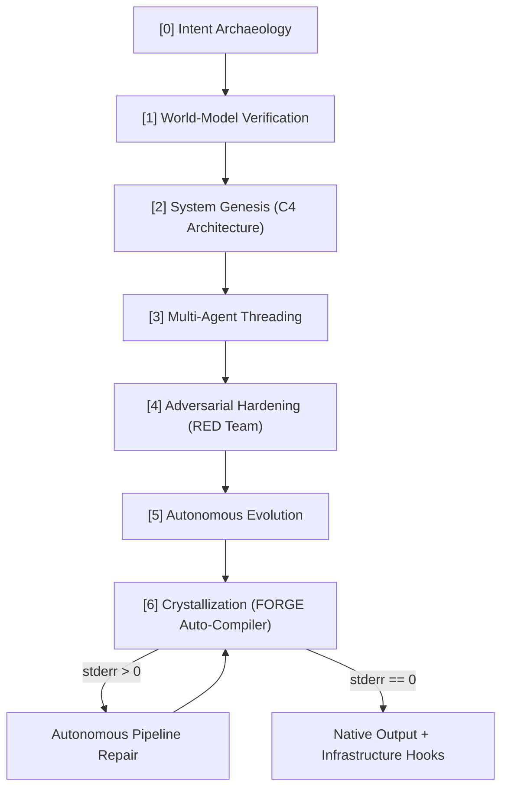

<div align="center">
  
  
  <br/>
  
  <h1 style="margin-top: 10px;"><b>G E N E S I S _ v2.0</b></h1>
  <h3>The Supreme Autonomous Agentic Civilization Framework</h3>

  <p align="center">
    <b>A multi-modal intelligence orchestration engine designed to fully architect, crystallize, and deploy production-scale codebases strictly from a single natural-language intent.</b>
  </p>
  
  <br/>

  <!-- Badges -->
  <p align="center">
    <a href="https://github.com/siddhantchandorkar752-ai/Genesis-AI-Agent/stargazers"></a>
    <a href="https://github.com/siddhantchandorkar752-ai/Genesis-AI-Agent/network/members"></a>
    <a href="https://github.com/siddhantchandorkar752-ai/Genesis-AI-Agent/issues"></a>
    <a href="https://python.org"></a>
    <a href="https://reactjs.org/"></a>
    <a href="https://opensource.org/licenses/MIT"></a>
  </p>
</div>

<hr/>

## 🌐 Vision

Welcome to the future of software engineering. **GENESIS v2.0** completely completely eclipses standard "wrapper" AI bots by acting as a distributed *civilization* of intelligence. It is engineered with a rigorous, deterministic **7-Phase Pipeline** powered by LangGraph, distributing cognitive load across **21 Specialized Agents** and retaining context through an exhaustive **12-Layer Memory Matrix**.

Whether you request a simple backend CRUD API or a decentralized Multi-Modal CV Robotics Node, GENESIS will strategize, debate, auto-code, error-correct, and finalize the raw project on your local machine autonomously.

---

## ⚡ Core Architecture

### 1. The 21-Agent Council Matrix
Cognitive labor is vertically scaled across 4 distinct operational tiers:
- **Strategic Tier**: `[ORACLE]`, `[ARCH]`, `[PHIL]`, `[ECON]`
- **Execution Tier**: `[PLAN]`, `[DATA]`, `[DS]`, `[ML]`, `[SIM]`
- **Quality Tier**: `[QA]`, `[RED]`, `[SEC]`, `[CHAOS]`
- **Intelligence Tier**: `[SELF]`, `[KNOW]`, `[DEV]`, `[MON]`, `[ETH]`, `[UX]`, `[FORGE]`

### 2. Formidable 12-Layer Cognitive Memory
GENESIS implements human-like episodic recall abstracting short-term and persistent vectors.
> *L1_SENSORY → L2_WORKING → L3_EPISODIC → L4_SEMANTIC → L5_PROCEDURAL → L6_EXPERIMENT → L7_ERROR → L8_OPTIMIZATION → L9_GRAPH → L10_COUNTERFACTUAL → L11_STRATEGIC → L12_COLLECTIVE*

### 3. Agent 22 `[FORGE]` — The Local-To-Cloud Bridge
Unlike conversational bots, GENESIS connects directly to your filesystem via Agent 22. 
- Analyzes semantic intentions.
- Serializes full recursive Code Buffers using Google Gemini.
- Runs `subprocess` terminal hooks to forcefully execute python code locally.
- Injects `stderr` tracebacks into a self-repairing LangChain loop until achieving **0 exceptions**.

---

## 🌌 The Execution Graph



---

## 🚀 Quickstart & Setup

To unleash the framework natively, you will require `Python 3.11+`, `Node.js 18+`, and `Poetry`.

### 1. Initialize The Intelligence Core

```bash
git clone https://github.com/siddhantchandorkar752-ai/Genesis-AI-Agent.git
cd Genesis-AI-Agent/genesis/backend

# Create environment configuration
cp .env.example .env
```
> **CRITICAL SETUP**: Open `.env` and assign your `GEMINI_API_KEY`. Without a Large Language Engine API key, the `[FORGE]` constructor cannot perform unsupervised terminal coding.

### 2. Boot The Backend API

```bash
poetry install
poetry add langchain langchain-core langchain-google-genai python-dotenv
poetry run uvicorn main:app --reload
```
*The Orchestrator listens securely at `http://localhost:8000`.*

### 3. Spin Up The Cyber-Dash

```bash
cd ../frontend
npm install
npm run dev
```
*Port `5173` is now streaming the execution telemetry.*

---

## 💻 Operation Manual

Once the dashboard is online at `http://localhost:5173`:
1. Focus the **Terminal Input Area**.
2. Feed your intent. High-complexity is encouraged (*e.g. "Build a YOLO11 tracking pipeline utilizing knowledge distillation on K3s node"*).
3. Click **ENGAGE**.
4. The dashboard will animate the active **Council Matrix** members and index your **L1-L12 Memory Banks**.
5. Upon Phase 6 completion, navigate directly to your parent directory. The Agent will have created a dynamically named physical directory (*e.g. `project-x4f1/`*) containing the complete, autonomous error-checked code repository!

---

## 🛡️ Chaos & Security Notice

**Warning**: The GENESIS `[FORGE]` protocol possesses the capability to run native system binaries (`pip install`, `python`) synchronously. 
Do **NOT** feed adversarial prompts or execution instructions derived from external, unknown actors into the framework. Use isolated execution nodes (`docker`) if processing unchecked internet inputs.

<br/>

<div align="center">
  <b>Built with Excellence by <a href="https://github.com/siddhantchandorkar752-ai">Siddhant Chandorkar</a></b>
  <p><i>MIT License © 2026. Setting the benchmark for Multi-Agent Software Development.</i></p>
</div>
