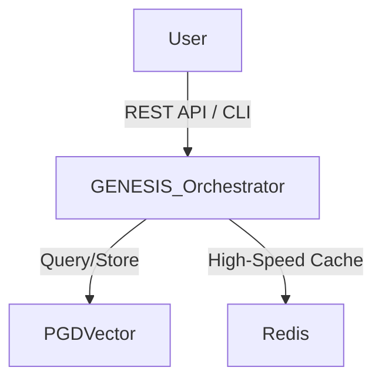
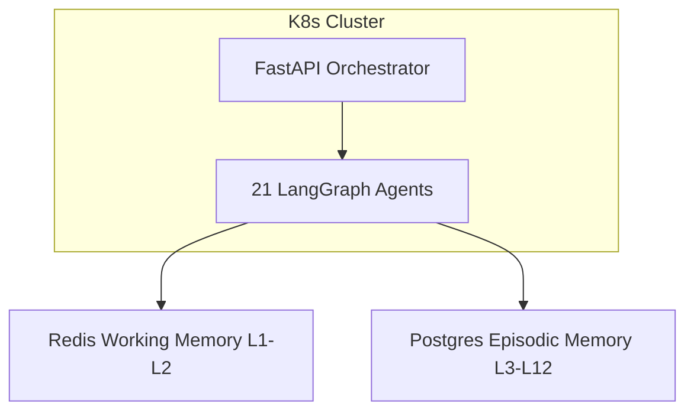
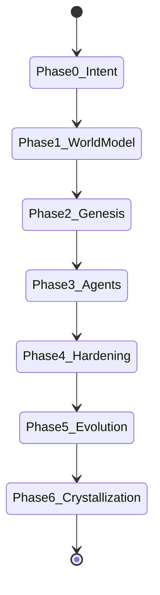

# GENESIS v2.0 Architecture Details

## System Context

```mermaid
graph TD;
    User-->|REST API / CLI| GENESIS_Orchestrator;
    GENESIS_Orchestrator-->|Query/Store| PGDVector;
    GENESIS_Orchestrator-->|High-Speed Cache| Redis;
```

## Container Diagram

```mermaid
graph TD;
    subgraph K8s Cluster
      API[FastAPI Orchestrator]
      Workers[21 LangGraph Agents]
      API-->Workers;
    end
    Workers-->Redis[Redis Working Memory L1-L2];
    Workers-->Postgres[Postgres Episodic Memory L3-L12];
```

## Code Diagram (LangGraph)

```mermaid
stateDiagram-v2
    [*] --> Phase0_Intent
    Phase0_Intent --> Phase1_WorldModel
    Phase1_WorldModel --> Phase2_Genesis
    Phase2_Genesis --> Phase3_Agents
    Phase3_Agents --> Phase4_Hardening
    Phase4_Hardening --> Phase5_Evolution
    Phase5_Evolution --> Phase6_Crystallization
    Phase6_Crystallization --> [*]
```
