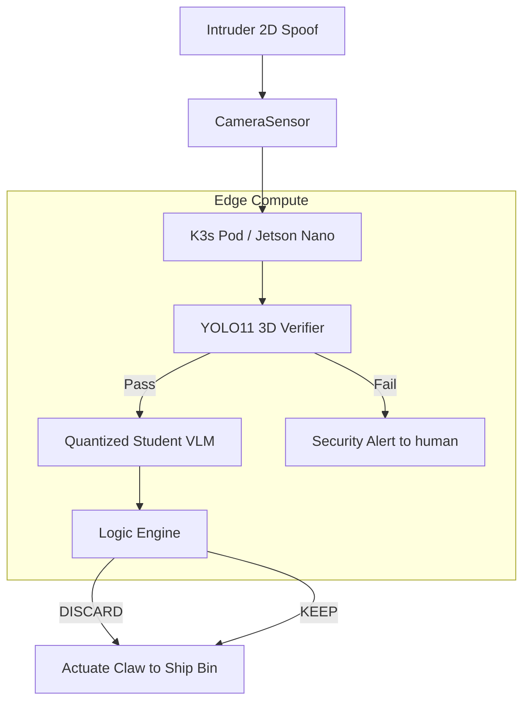

# C4 Architecture: Autonomous Inventory Bot

## 1. System Context
The edge robot operating in the physical warehouse, intercepting imagery and performing inference while communicating with the central orchestrator via K3s.

## 2. Container Diagram

### Sensor Spoofing Defense
The [RED] team spoofing (where an intruder uses printed 2D images to trick the system) is blocked at the `YOLO11 3D Verifier` phase, which validates the Z-depth of the bounding box before continuing to VLM.
